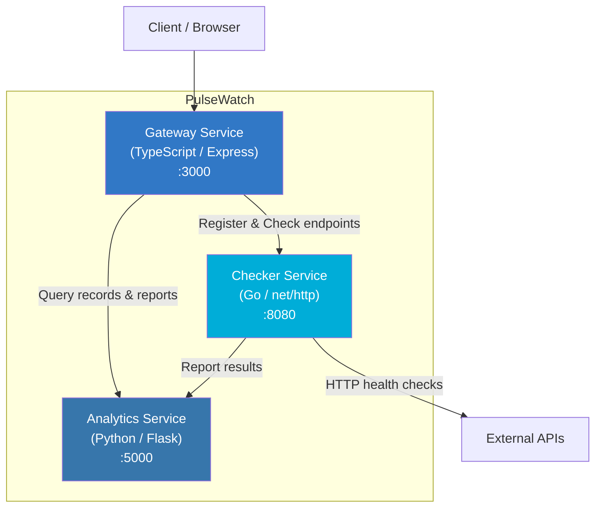

# PulseWatch

Real-time API health monitoring platform with polyglot microservices.

PulseWatch lets you register API endpoints, run health checks against them, and view uptime analytics and performance reports — all through a unified gateway API.

## Architecture



### Services

| Service | Language | Port | Description |
|---------|----------|------|-------------|
| **Gateway** | TypeScript (Express) | 3000 | API gateway — routes requests to backend services, aggregates health status |
| **Checker** | Go (net/http) | 8080 | Performs health checks on registered endpoints, reports results to Analytics |
| **Analytics** | Python (Flask) | 5000 | Stores health check records, generates uptime and performance reports |

## Quick Start

### Prerequisites

- Docker & Docker Compose
- (For local development) Python 3.12+, Go 1.22+, Node.js 20+

### Run with Docker Compose

```bash
# Clone the repository
git clone https://github.com/mohadayo/pulsewatch.git
cd pulsewatch

# Copy environment file
cp .env.example .env

# Start all services
make up
# or
docker compose up --build -d
```

### Run Tests

```bash
# All tests
make test

# Individual services
make test-python
make test-go
make test-ts

# Linting
make lint
```

## API Reference

All endpoints are accessible through the Gateway at `http://localhost:3000`.

### Health Checks

| Method | Endpoint | Description |
|--------|----------|-------------|
| `GET` | `/health` | Gateway health check |
| `GET` | `/api/v1/status` | Aggregated health status of all services |

### Endpoint Management

| Method | Endpoint | Description |
|--------|----------|-------------|
| `GET` | `/api/v1/endpoints` | List all registered endpoints |
| `POST` | `/api/v1/endpoints` | Register a new endpoint |

**POST /api/v1/endpoints** body:
```json
{
  "url": "https://api.example.com/health",
  "name": "Example API"
}
```

### Health Check Operations

| Method | Endpoint | Description |
|--------|----------|-------------|
| `POST` | `/api/v1/check` | Check a single URL |
| `POST` | `/api/v1/check-all` | Check all registered endpoints |

**POST /api/v1/check** body:
```json
{
  "url": "https://api.example.com/health"
}
```

### Analytics

| Method | Endpoint | Description |
|--------|----------|-------------|
| `GET` | `/api/v1/records` | List health check records |
| `GET` | `/api/v1/records?endpoint=URL&limit=N` | Filter records by endpoint（`limit` は 1〜`LIST_MAX_LIMIT`） |
| `POST` | `/api/v1/records` | Add a record（`endpoint` は `http(s)://` 必須・最大 `MAX_ENDPOINT_LENGTH`、`status_code` は 100〜599、`response_time_ms` は 0〜`MAX_RESPONSE_TIME_MS` の有限数、`checked_at` は ISO 8601） |
| `DELETE` | `/api/v1/records?endpoint=URL` | 指定エンドポイントのレコードを削除 |
| `GET` | `/api/v1/report` | Get uptime and performance report |

### Usage Examples

```bash
# Register an endpoint
curl -X POST http://localhost:3000/api/v1/endpoints \
  -H "Content-Type: application/json" \
  -d '{"url": "https://httpbin.org/get", "name": "HTTPBin"}'

# Check all registered endpoints
curl -X POST http://localhost:3000/api/v1/check-all

# View the analytics report
curl http://localhost:3000/api/v1/report

# Check service status
curl http://localhost:3000/api/v1/status
```

## Environment Variables

| Variable | Default | Description |
|----------|---------|-------------|
| `GATEWAY_PORT` | `3000` | Gateway service port |
| `CHECKER_PORT` | `8080` | Checker service port |
| `ANALYTICS_PORT` | `5000` | Analytics service port |
| `CHECKER_URL` | `http://localhost:8080` | Checker service URL |
| `ANALYTICS_URL` | `http://localhost:5000` | Analytics service URL |
| `LOG_LEVEL` | `INFO` | Log level (DEBUG, INFO, WARNING, ERROR) |
| `MAX_RECORDS` | `10000` | Analytics: 保存レコード上限 |
| `MAX_ENDPOINT_LENGTH` | `2048` | Analytics: `endpoint` 最大長 |
| `MAX_RESPONSE_TIME_MS` | `600000` | Analytics: `response_time_ms` の上限 |
| `LIST_DEFAULT_LIMIT` | `100` | Analytics: `GET /api/v1/records` のデフォルト件数 |
| `LIST_MAX_LIMIT` | `1000` | Analytics: `GET /api/v1/records?limit=` の上限 |

## Makefile Commands

| Command | Description |
|---------|-------------|
| `make test` | Run all tests |
| `make test-python` | Run Python tests |
| `make test-go` | Run Go tests |
| `make test-ts` | Run TypeScript tests |
| `make lint` | Run all linters |
| `make up` | Start services with Docker Compose |
| `make down` | Stop services |
| `make build` | Build Docker images |
| `make clean` | Remove containers, images, and volumes |

## CI/CD

GitHub Actions workflow runs on push/PR to `main`:
1. Python tests + flake8 lint
2. Go tests + go vet
3. TypeScript tests + ESLint
4. Docker Compose build (after all tests pass)

> **Note:** The `.github/workflows/ci.yml` file may need to be added manually after initial repository setup due to GitHub API restrictions on the `.github/` directory.

### CI Workflow Content

```yaml
name: CI

on:
  push:
    branches: [main]
  pull_request:
    branches: [main]

jobs:
  test-python:
    runs-on: ubuntu-latest
    defaults:
      run:
        working-directory: services/analytics
    steps:
      - uses: actions/checkout@v4
      - uses: actions/setup-python@v5
        with:
          python-version: "3.12"
      - run: pip install -r requirements.txt
      - run: flake8 --max-line-length=120 app.py
      - run: pytest -v

  test-go:
    runs-on: ubuntu-latest
    defaults:
      run:
        working-directory: services/checker
    steps:
      - uses: actions/checkout@v4
      - uses: actions/setup-go@v5
        with:
          go-version: "1.22"
      - run: go vet ./...
      - run: go test -v ./...

  test-typescript:
    runs-on: ubuntu-latest
    defaults:
      run:
        working-directory: services/gateway
    steps:
      - uses: actions/checkout@v4
      - uses: actions/setup-node@v4
        with:
          node-version: "20"
      - run: npm install
      - run: npx eslint src/ --ext .ts
      - run: npm test

  docker-build:
    runs-on: ubuntu-latest
    needs: [test-python, test-go, test-typescript]
    steps:
      - uses: actions/checkout@v4
      - run: docker compose build
```

## License

MIT
